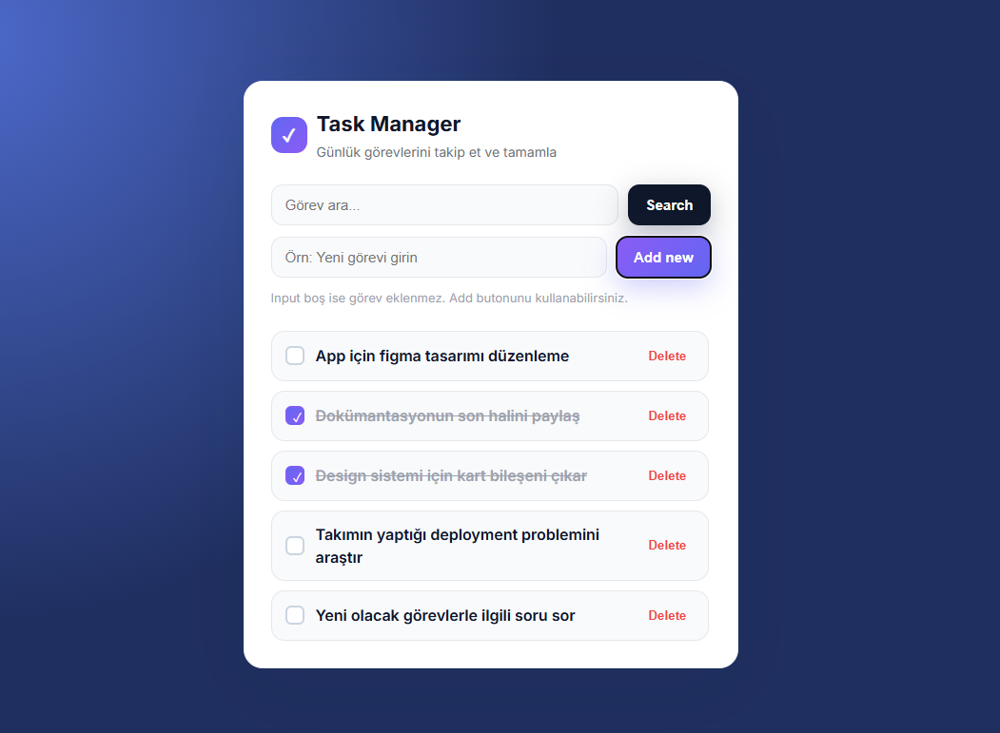

# ToDo React - Task Manager

Bu proje, React ile geliştirilmiş modern bir görev (to-do) yönetim uygulamasıdır. Günlük görevlerinizi kolayca ekleyip, tamamlayıp, silebilir ve arayabilirsiniz.

## Özellikler
- Görev ekleme ("Add new" butonu ile)
- Görev silme ("Delete" butonu ile)
- Görev tamamlama
- Görev arama
- Modern ve kullanıcı dostu arayüz


## Ekran Görüntüleri
Uygulamanın bazı ekran görüntüleri aşağıda örneklenmiştir:

### Tüm Görevler


### Tamamlanan Görevler


### Arama Sonucu


### Görev Ekleme (Add new Butonu)



### Görev Silme (Delete Butonu)


## Kurulum ve Çalıştırma

Bu proje iki kısımdan oluşur:
- **frontend**: React ile yazılmış arayüz (Vite)
- **backend**: Node.js + Express + SQLite (Knex ile) yazılmış API


### 1. Backend (API) kurulumu

1. Terminalde backend dizinine gelin:

   ```bash
   cd backend
   npm install
   ```

2. Backend sunucusunu başlatın:

   ```bash
   node src/index.js
   ```

   Sunucu ilk çalıştırıldığında aynı dizinde `todo.sqlite3` dosyası otomatik oluşur. Varsayılan olarak `http://localhost:4000` adresinde çalışır.

> **Not:** Artık MongoDB veya .env dosyasına gerek yoktur. Tüm veriler SQLite veritabanında saklanır.

### 2. Frontend (React) kurulumu

1. Ayrı bir terminalde frontend dizinine gelin:

   ```bash
   cd frontend
   npm install
   npm run dev
   ```

2. Tarayıcıda Vite'in verdiği URL'yi açın (genellikle `http://localhost:5173`).

> İsteğe bağlı: Frontend tarafında API adresini değiştirmek için `frontend` klasörüne `.env` dosyası ekleyip içine şu satırı yazabilirsiniz:
>
> ```env
> VITE_API_URL=http://localhost:4000/api
> ```


---

Bu proje, görevlerinizi düzenli ve verimli şekilde yönetmeniz için tasarlanmıştır.
