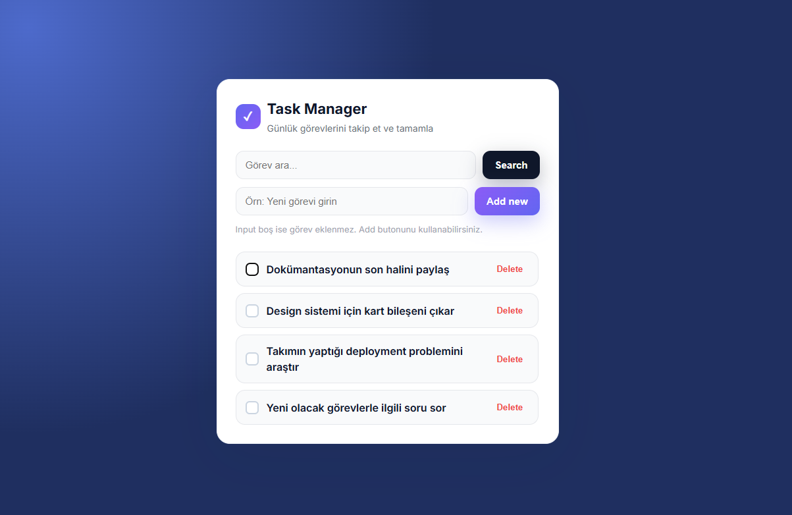
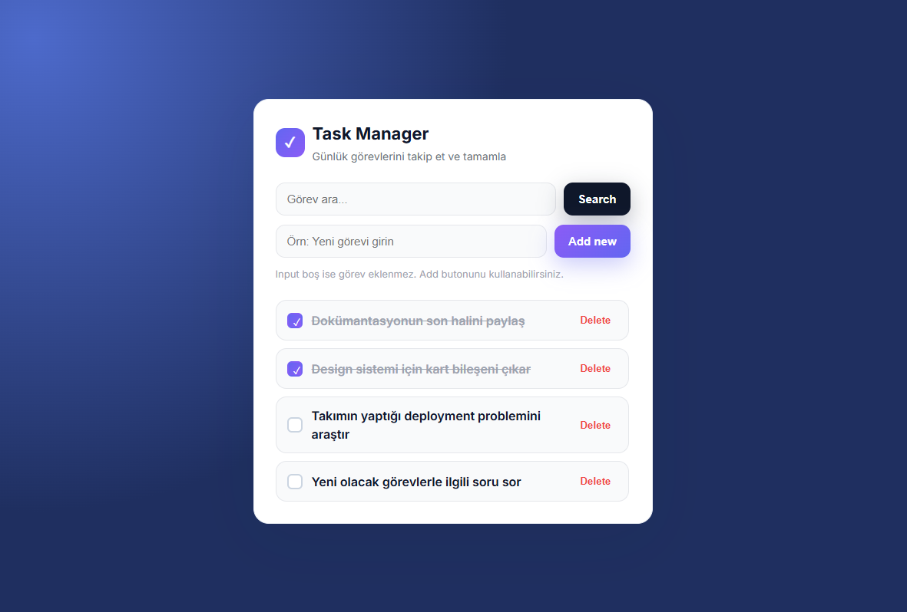
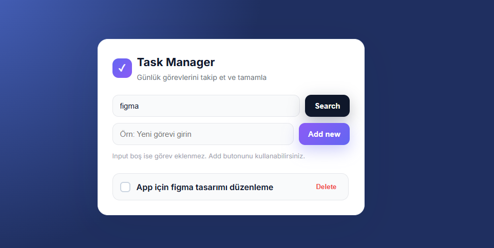
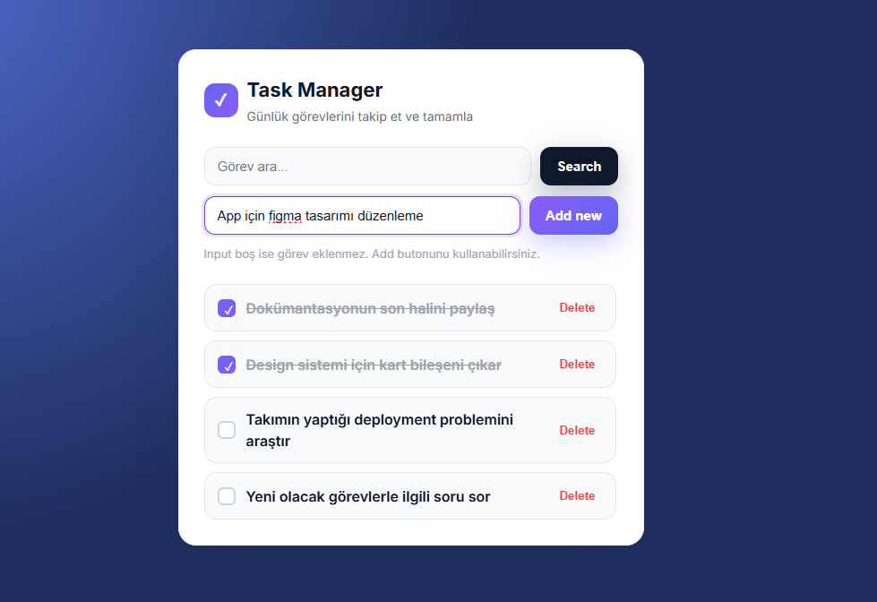
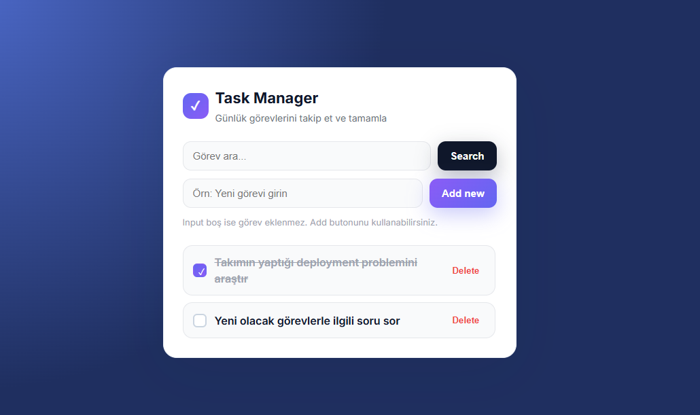

# ToDo React - Task Manager

Bu proje, React ile geliştirilmiş modern bir görev (to-do) yönetim uygulamasıdır. Günlük görevlerinizi kolayca ekleyip, tamamlayıp, silebilir ve arayabilirsiniz.

## Özellikler
- Görev ekleme ("Add new" butonu ile)
- Görev silme ("Delete" butonu ile)
- Görev tamamlama
- Görev arama
- Modern ve kullanıcı dostu arayüz


## Ekran Görüntüleri
Uygulamanın bazı ekran görüntüleri aşağıda örneklenmiştir:

### Tüm Görevler


### Tamamlanan Görevler


### Arama Sonucu


### Görev Ekleme (Add new Butonu)


### Görev Silme (Delete Butonu)


## Kurulum ve Çalıştırma
1. Terminalde proje dizinine gelin:
	```bash
	cd frontend
	npm install
	npm run dev
	```
2. Tarayıcıda `http://localhost:5173` adresini ziyaret edin.

---

Bu proje, görevlerinizi düzenli ve verimli şekilde yönetmeniz için tasarlanmıştır.
